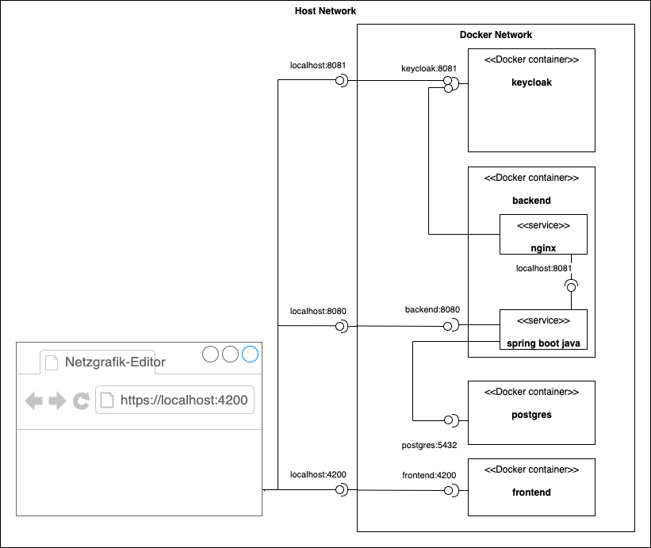

# Netzgrafik-Editor Local Deployment with Docker Compose

This repository provides a [Docker Compose](https://docs.docker.com/compose/) file for local deployment of Netzgrafik Editor including

* [netzgrafik-editor-frontend](https://github.com/SchweizerischeBundesbahnen/netzgrafik-editor-frontend)
* [netzgrafik-editor-backend](https://github.com/SchweizerischeBundesbahnen/netzgrafik-editor-backend)
* [Keycloak](https://github.com/keycloak/keycloak) for Identity and Access Management
* [PostgreSQL](https://www.postgresql.org/) database for backend data

The setup is based on the published images from the GitHub container registry at
[ghcr.io/schweizerischebundesbahnen](https://github.com/orgs/SchweizerischeBundesbahnen/packages).
It requires only `docker` and `docker compose`.
No further local dev tools (like `mvn`, `npm` etc.)  are required.
For local dev setup, please refer to the frontend and backend repos.

## Local Deployment with Docker Compose

Start containers:

```shell
docker compose up -d
```
and then go to http://localhost:4200/

Stop containers:

```shell
docker compose stop 
```

Remove containers and data:

```shell
docker compose down 
```

## Overview

The following diagram shows the network wiring:



Keycloak tokens are issued for `http://localhost:8081/realms/netzgrafikeditor`.
As the backend verifies these tokens, a reverse proxy needs to be run in the backend Docker container.

## License

This project is licensed under [Apache 2.0](LICENSE).
